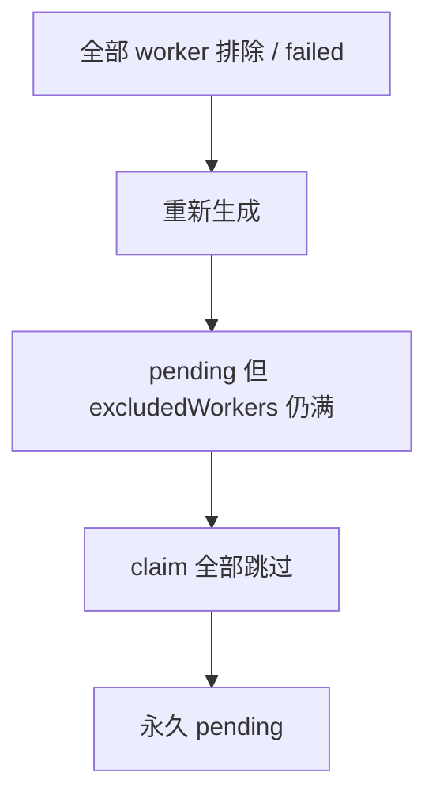
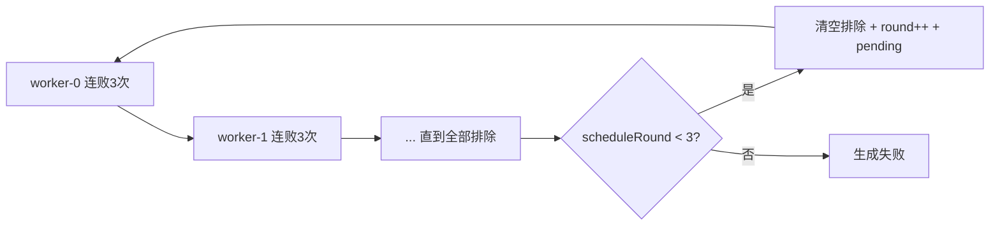

# Worker 轮换、超时失败与前端展示

## 根因（卡 pending 的真正原因）

[`auto-vi/src/tasks/tasks.service.ts`](auto-vi/src/tasks/tasks.service.ts) 的 `regenerate` **没有清空** `excludedWorkers`。流程会变成：

1. 某轮改派把 `[0,1,2,3,4]` 全部写入排除列表，任务本应 `failed`
2. 前端点「重新生成」→ 状态变回 `pending`，但排除列表仍在
3. [`findQueueClaim`](auto-vi/src/tasks-queue/tasks-queue.service.ts) 跳过所有已排除 profile → **没有任何 worker 能领** → 永久 pending

这正好解释「浏览器已空闲、worker 其实是好的，但任务一直 pending」。

## 目标调度模型

保留现有「同一 worker 可改派错误连败 3 次再排除」；补上「大轮换」：

- 一轮 = 把 `0 .. MAX_BROWSERS-1` 都排除一遍
- 满 3 轮仍失败 → `failed`，前端可「重新生成」
- 重新生成：清空 `excludedWorkers`、`scheduleRound`、worker 绑定，从零再消费

## 改动点

### 1. auto-vi：数据与改派

- [`task-queue.entity.ts`](auto-vi/src/entities/task-queue.entity.ts)：新增 `scheduleRound`（int，默认 `0`；表示已完成的大轮次数）
- production 下 `synchronize` 关闭时，补一次 SQLite `ALTER TABLE`（启动或文档脚本）加列
- [`tasks-queue.service.ts`](auto-vi/src/tasks-queue/tasks-queue.service.ts) `reassign`：
  - 当前轮全部排除后：若 `scheduleRound + 1 < 3` → 清空 `excludedWorkers`，`scheduleRound++`，退回 `pending`（`reassigned: true`）
  - 否则 → `failed`（`reassigned: false`）
- [`tasks.service.ts`](auto-vi/src/tasks/tasks.service.ts) `regenerate`：额外清空 `excludedWorkers`、`scheduleRound`

### 2. auto-vi：pending 超时自动失败

- 在 `TasksQueueService`（或独立 scheduled service）用 `@Interval`：扫描 `status in ('pending','retrying')` 且 `createdAt <= now - 1 day` 的队列
- 置队列 + 对应 task 为 `failed`，`errorMessage` 标明「pending 超过 1 天自动失败」
- 同时把已卡死、`excludedWorkers` 已覆盖全部可用 profile、但仍是 pending 的任务一并失败（兜底历史脏数据；与 1 天规则可同一次扫描处理）

### 3. auto-vi：任务列表带出 worker

- [`tasks.service.ts`](auto-vi/src/tasks/tasks.service.ts) `findAll`：`leftJoinAndSelect('task.queues', 'queues')`，前端可读 `queues[0].workerId` / `profileIndex` / `excludedWorkers` / `scheduleRound`

### 4. tk-auto：scheduler 适配

- [`consumer-scheduler.service.ts`](tk-auto/src/consumer/consumer-scheduler.service.ts)：日志区分「本轮改派」vs「开启下一轮大重试」vs「3 轮后最终失败」；`ReassignResult` 可带上 `scheduleRound`（若接口返回）
- `MAX_BROWSERS` 硬上限从 `5` 提到 `10`（与你说的 1–10 对齐），[`consumer.service.ts`](tk-auto/src/consumer/consumer.service.ts) 与 auto-vi `reassign` 内的 `Math.min(..., 5)` 一并改成 `10`

### 5. vi-admin：列表展示

- 任务列表 [`welcome/columns.tsx`](vi-admin/src/views/welcome/columns.tsx)：增加「Worker」列  
  - 当前：`worker-{profileIndex}` 或 `workerId`  
  - 若有排除：旁注 `排除: 0,2`（解析 `excludedWorkers`）
- 队列列表 [`queued/utils/hook.tsx`](vi-admin/src/views/queued/utils/hook.tsx)：增加 `workerId` / `profileIndex` / `excludedWorkers` / `scheduleRound` 列（队列页数据本就有这些字段，补展示即可）

## 不动的部分

- 可改派错误判定（积分 / chatbox / loadState）保持不变
- 单 worker 连败 3 次阈值（`SCHEDULER_MAX_WORKER_FAILURES`）保持不变
- 成功路径、下载器逻辑不改
