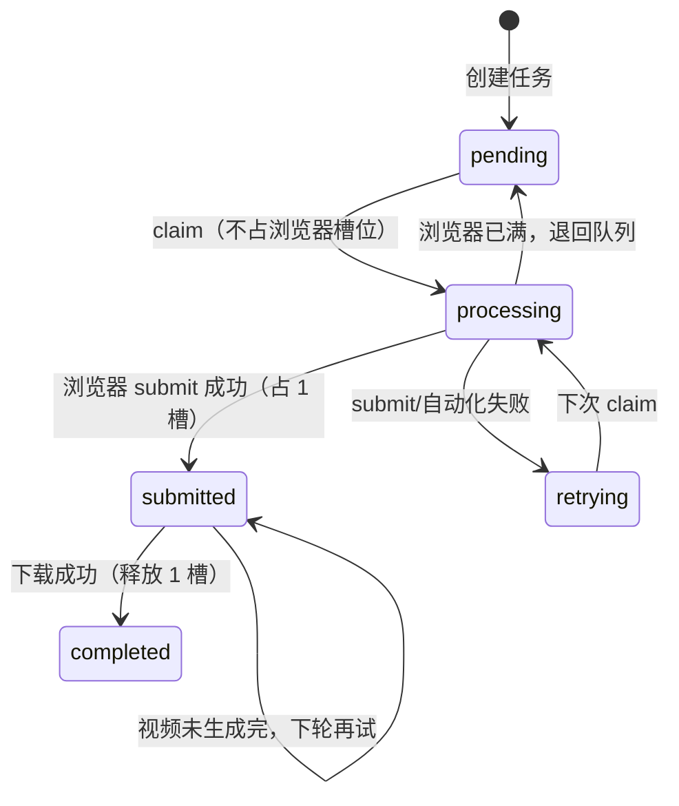
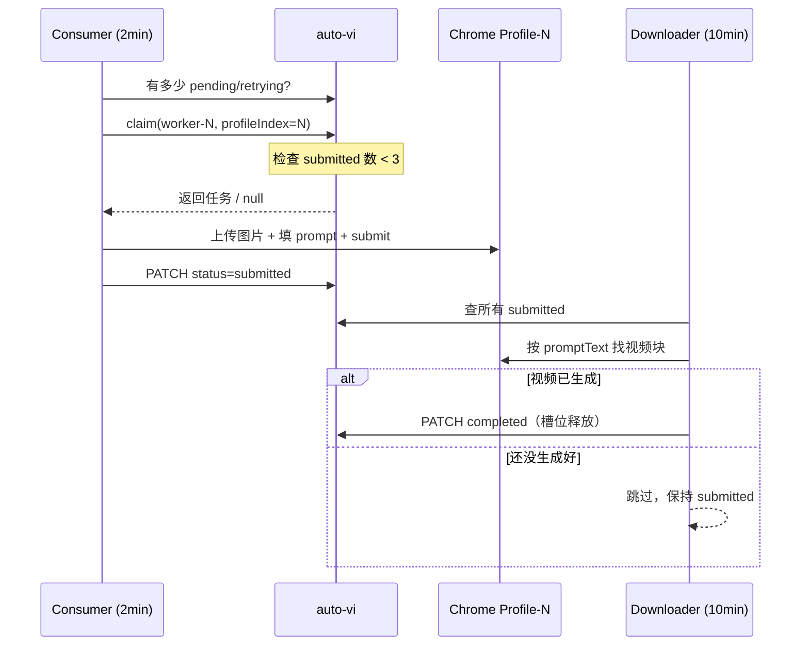

# Profile video generation limits
_Exported on 7/10/2026 at 12:00:39 GMT+8 from Cursor (3.8.11)_

---

**User**

当前功能已经实现的非常好了，基础功能是 tk-auto 会定时轮询 任务列表的任务 去消费，消费好的任务 轮询检测 只要 浏览器视频生成好就 拿prompt比对下载，总之现在基础功能非常好，不要新的改动动到基础功能。目前需要增加个功能 每个profile 或者worker 对应的同时只能生成3个视频，也就是说每个profile 或 worker 在消费3个以上任务 浏览器 submit 会禁用提交不上去，于此同时 当 浏览器 每生成完 一个 视频 可以再次提交一个，你需要帮我设计一下这个，在数据库增加字段看一下， 我的想法是 消费任务时 需要记录 当前 profile 消费了多少任务 下载任务时 需要记录 当前profile 有没有把之前的任务下载下来 如果有下载证明 这个profile 可以继续 submit, 或者 当submit 提交失效 就知道该浏览器 已经不能消费该任务。 反正我已经描述清楚了

---

**Cursor**

先梳理现有任务消费、profile/worker 与数据库结构，再在不改动基础流程的前提下设计每 profile 最多 3 个并发生成的方案。


你的思路是对的：**用「已提交但未下载完成」的任务数，作为每个 profile 的并发占用数**。下面是在不动现有主流程（轮询 → claim → 浏览器 submit → 轮询下载）前提下的设计方案。

---

## 核心结论：优先不新增计数表，复用现有字段即可

当前 `task_queue` 里已经有足够信息：

| 字段 | 含义 |
|------|------|
| `profile_index` | 哪个浏览器 profile 处理的 |
| `status = 'submitted'` | 已在 TikTok 页面提交，视频在生成或待下载 |
| `status = 'completed'` | 已下载完成，槽位释放 |

**每个 profile 当前占用槽位数 =**

```sql
SELECT COUNT(*) FROM task_queue
WHERE profile_index = ? AND status = 'submitted'
```

- submit 成功 → `status` 变为 `submitted` → 占用 +1  
- 下载完成 → `status` 变为 `completed` → 占用 -1  
- submit 失败（重试/失败）→ 从未进入 `submitted` → 不占用  

这和你的描述一致：**消费并 submit 成功算占用；下载完成才算释放，可再 submit 一个。**

---

## 状态与槽位关系



要点：

- `processing` **不计入** 3 个上限（只是在上传图片、填 prompt，浏览器里还没多一个生成任务）
- 只有 `submitted` 才代表 TikTok 页面上有一个在生成/待下载的视频
- `failed` / `retrying` 不占槽位

---

## 推荐改动点（最小侵入）

### 1. auto-vi：claim 时做槽位校验（服务端兜底）

在现有 `POST /api/tasks-queue/claim` 上扩展参数，不改基础接口语义：

```typescript
// 请求
{ workerId: "worker-0", profileIndex: 0 }

// 服务端 findQueueClaim 开头增加
const inFlight = await count({ status: 'submitted', profileIndex });
if (inFlight >= MAX_CONCURRENT_PER_PROFILE) return null; // 3

// 原有 claim 逻辑不变...
```

建议 `MAX_CONCURRENT_PER_PROFILE` 放环境变量，默认 `3`。

**为什么放 claim 而不是只在 tk-auto 本地判断？**  
服务端统一校验，避免多实例或以后扩展时计数不一致。

### 2. tk-auto consumer：`runWorker` 循环前检查（客户端提前短路）

在 `claimNextPendingTask` 之前不必再查一次也行（claim API 已兜底），但加一层本地检查可以减少无效 HTTP：

```typescript
while (true) {
  // 可选：先 GET 槽位，已满则 break
  const item = await claimNextPendingTask(workerId, profileIndex);
  if (!item) break;

  const ok = await processTask(item, profileIndex);
  if (!ok) break; // 保持现有逻辑
}
```

`runWorker` 里 `while` 循环不变，只是 claim 返回 `null` 时自然退出——**一个 profile 满 3 个就停领，其他 profile 继续工作**。

### 3. 浏览器 submit 满额检测（你提到的「submit 失效」）

在 `submitCreativeStudioPrompt` 点击前增加检测：

```typescript
if (await sendBtn.isDisabled()) {
  throw new Error('SUBMIT_SLOT_FULL');
}
```

consumer 捕获 `SUBMIT_SLOT_FULL` 时**不要走现有 retry 逻辑**，而是：

1. 把任务退回 `pending`（`retry_count` 不变）
2. 清空 `worker_id`
3. 当前 worker `break`，等下载释放槽位后再领

这样不会误把「浏览器满了」当成任务失败。

### 4. downloader：无需改动

下载完成时已有：

```typescript
PATCH tasks-queue → completed
POST tasks/update → completed
```

`submitted` 减 1 是自动的，**不需要在 downloader 里额外减计数**。

---

## 数据库字段方案对比

### 方案 A（推荐）：不新增字段，只补 SQL 定义

利用现有 `profile_index` + `status`，零同步风险。

只需把 `auto-vi/data/db/task_queue.sql` 与 entity 对齐（目前 SQL 文件落后）：

```sql
-- 补全 status 枚举
status TEXT CHECK(status IN (
  'pending', 'processing', 'submitted',
  'completed', 'failed', 'retrying'
)) DEFAULT 'pending',

profile_index INTEGER,
render_index INTEGER,
```

生产环境若 `synchronize: false`，需手动 migration 加列。

### 方案 B（可选）：加时间字段，便于监控，不参与计数

如果希望在 vi-admin 看「这个视频在浏览器里等了多久」：

```sql
ALTER TABLE task_queue ADD COLUMN submitted_at TIMESTAMP;  -- submit 成功时写入
-- completed_at 已有，可作 downloaded_at 用
```

| 字段 | 写入时机 | 用途 |
|------|----------|------|
| `submitted_at` | PATCH → submitted | 监控生成耗时、排队时长 |
| `completed_at` | PATCH → completed | 已有，下载完成时间 |

**计数仍用 `status='submitted'`，不用这两个字段做加减。**

### 方案 C（不推荐）：独立 `browser_profile_slots` 表

```sql
CREATE TABLE browser_profile_slots (
  profile_index INTEGER PRIMARY KEY,
  in_flight_count INTEGER DEFAULT 0,
  max_slots INTEGER DEFAULT 3
);
```

submit 时 +1，download 时 -1。  
缺点：和 `task_queue` 双写，异常时容易漂移，还要处理崩溃、手动改库等。  
**除非有极高频查询需求，否则不如方案 A 直接 COUNT。**

---

## 完整流程（加限制后）

```
每 2 分钟 Consumer 轮询
    │
    ├─ worker-0 (profile-0)
    │     ├─ COUNT(submitted, profile=0) >= 3 ? → 停止领取
    │     ├─ claim → processing
    │     ├─ 浏览器 upload + submit
    │     │     ├─ 成功 → submitted（占用+1）→ 继续 claim
    │     │     └─ 按钮禁用 → 退回 pending，停止本 worker
    │     └─ ...
    │
    ├─ worker-1 (profile-1)  // 独立计数，互不影响
    └─ worker-N ...

每 10 分钟 Downloader 轮询
    │
    ├─ 查所有 submitted
    ├─ 按 profile_index 分组下载
    └─ 下载成功 → completed（该 profile 占用-1）
         → 下次 Consumer 轮询可再 claim 1 个
```

---

## 和你想法的对应关系

| 你的想法 | 设计映射 |
|----------|----------|
| 消费时记录 profile 消费了多少 | `COUNT(status='submitted' AND profile_index=N)` |
| 下载完成才能继续 submit | `completed` 后计数减少，claim 才允许 |
| submit 失效说明不能消费 | 检测按钮 disabled → 退回 pending，不增 retry |
| 每个 profile/worker 最多 3 个 | claim API + 可选 submit 前二次校验 |

---

## 不建议动的部分

- Consumer 2 分钟 / Downloader 10 分钟轮询间隔  
- promptText 匹配下载逻辑  
- `claimChain` 串行 claim  
- 失败后 worker 停止本轮领取  
- vi-admin 创建任务流程  

---

## 建议实施顺序

1. **auto-vi**：`findQueueClaim` 增加 `profileIndex` + 槽位校验（核心）  
2. **tk-auto**：claim 请求带上 `profileIndex`  
3. **tk-auto**：`submitCreativeStudioPrompt` 检测按钮 disabled + consumer 特殊处理  
4. **可选**：加 `submitted_at` 字段 + vi-admin 队列页展示「生成中时长」  
5. **文档**：同步 `task_queue.sql` schema  

---

如果你认可这个方案，我可以按上述顺序直接改代码，保证只动 claim 校验、submit 检测和退回 pending 三处，其余基础流程不动。你更倾向 **方案 A（纯复用字段）** 还是 **方案 A + submitted_at（加监控字段）**？

---

**User**

方案A

---

**Cursor**

按方案 A 实现：复用现有字段，在 claim 与 submit 处加槽位校验，不新增数据库字段。


文件编码被破坏，正在从 git 恢复并重新应用最小改动。


已按**方案 A**实现，未新增数据库字段，复用 `profile_index` + `status='submitted'` 作为并发槽位计数。

## 改动说明

### 1. auto-vi — claim 时校验槽位

`findQueueClaim(workerId, profileIndex)` 在领取前统计：

```sql
COUNT(*) WHERE status='submitted' AND profile_index=?
```

若 `>= 3`（可通过环境变量 `MAX_CONCURRENT_PER_PROFILE` 配置，默认 3），直接返回 `null`，该 profile 本轮不再领取。

claim 接口现在需要传：

```json
{ "workerId": "worker-0", "profileIndex": 0 }
```

### 2. tk-auto — 传递 profileIndex

`runWorker` → `claimNextPendingTask` → `doClaim` 全程带上 `profileIndex`，与服务端计数对应。

### 3. 浏览器 submit 满额兜底

`submitCreativeStudioPrompt` 点击前检测按钮是否 `disabled`，若是则抛出 `SUBMIT_SLOT_FULL`。

consumer 捕获后：
- 任务退回 `pending`（不增加 `retry_count`）
- 清空 `worker_id` / `profile_index`
- 停止当前 worker 本轮领取

### 4. 下载侧 — 无改动

下载完成时原有 `submitted → completed` 逻辑不变，槽位自动释放。

## 运行逻辑

```
profile-0 已有 3 个 submitted
  → claim 返回 null → worker-0 停止

profile-1 只有 1 个 submitted
  → 可继续 claim 并 submit

某任务下载完成 → submitted 变 completed
  → profile-0 槽位 -1 → 下次轮询可再领 1 个
```

## 涉及文件

| 文件 | 变更 |
|------|------|
| `auto-vi/src/tasks-queue/tasks-queue.service.ts` | 槽位计数 + claim 校验 |
| `auto-vi/src/tasks-queue/tasks-queue.controller.ts` | claim 接收 `profileIndex` |
| `auto-vi/src/tasks-queue/dto/update-task-queue.dto.ts` | 支持清空 `workerId` |
| `tk-auto/src/consumer/consumer.service.ts` | 传 profileIndex + 满额退回 |
| `tk-auto/src/core/browser/creative-studio.helper.ts` | submit 按钮禁用检测 |
| `auto-vi/data/db/task_queue.sql` | 文档对齐（补 `submitted`、`profile_index`） |

两个服务均已 `npm run build` 通过。重启 **auto-vi** 和 **tk-auto** 后生效。如需调整上限，在 auto-vi 的 `.env` 中加：

```
MAX_CONCURRENT_PER_PROFILE=3
```

---

**User**

你能帮我梳理下 tk-auto 的消费任务是怎么消费的吗， 初始2分钟 开5个profile 同时 消费 task 每个 profile 消费 3个task 后， 假如 2分后  task 没生成 那么 profile 会怎样？ 阻塞吗 还是继续取出任务 提交 发现提交不了， 还有就是假设提交了30分钟了 该 profile 还是3个 证明 该profile 有个视频创建失败  这个要怎么处理呢？

---

**Cursor**

先对照当前代码梳理 tk-auto 的消费流程，并回答你关心的 profile 满额与长时间未生成两种情况。


下面按**当前代码实际行为**梳理，并直接回答你关心的两个场景。

---

## 一、tk-auto 消费任务的完整流程

系统里其实有**两个独立轮询**，不要混在一起看：

| 服务 | 间隔 | 职责 |
|------|------|------|
| **Consumer** | 2 分钟 | 领任务 → 浏览器上传图片 + 填 prompt + 点提交 |
| **Downloader** | 10 分钟 | 查 `submitted` 任务 → 按 prompt 匹配页面视频 → 下载 → 改 `completed` |



### 单次 Consumer 轮询（2 分钟）里发生什么

1. 查 `pending` + `retrying` 任务总数
2. 启动 `min(5, 待处理数)` 个 worker，即 `profile-0` ~ `profile-4` **并行**
3. 每个 `runWorker(profileIndex)` 内部是 **`while` 串行循环**：

```
while (true) {
  claim(profileIndex)     // 服务端检查：该 profile 的 submitted 是否 < 3
  if (null) break;        // 满了或没任务 → 退出

  浏览器处理任务 → submit 成功 → status = submitted
  if (失败) break;        // 本轮停止继续领
}
```

所以：
- **5 个 profile 之间是并行的**
- **同一个 profile 里是串行的**，可以连续 submit 第 1、2、3 个
- 第 4 次 claim 时，服务端发现已有 3 个 `submitted` → 返回 `null` → 该 worker 退出

### 槽位怎么算（方案 A）

```typescript
// auto-vi tasks-queue.service.ts
COUNT(*) WHERE status='submitted' AND profile_index=N
```

- submit 成功 → `submitted` → 占 1 槽
- 下载完成 → `completed` → 释放 1 槽
- `processing`（正在上传图片）**不算**槽位

---

## 二、你问的场景：3 个都 submit 了，2 分钟后视频还没生成，profile 会怎样？

### 结论：**不会在 claim 层阻塞挂死，但该 profile 本轮不再消费新任务**

2 分钟后的下一轮 Consumer：

```
profile-0 已有 3 个 submitted
  → claim API 直接返回 null（inFlight >= 3）
  → while 第一次就 break
  → 不会打开浏览器、不会上传图片、不会点 submit
```

也就是说：

| 行为 | 当前实现 |
|------|----------|
| 会不会继续 claim 任务？ | **不会**，claim 就被拦住了 |
| 会不会领了任务才发现 submit 不了？ | **正常路径不会**，claim 前就检查了 |
| 会不会整个 tk-auto 卡死？ | **不会**，该 profile 的 worker 秒退，其他 profile 照常 |
| 浏览器页面 | 保持打开，3 个视频在 TikTok 页面上继续生成 |

### 唯一的例外：竞态兜底

如果 claim 时只有 2 个 `submitted`，领完任务、上传完图片，到点 submit 时浏览器已满：

- `submitCreativeStudioPrompt` 检测到按钮 `disabled`
- 抛 `SUBMIT_SLOT_FULL`
- 任务退回 `pending`（**不增加 retry_count**）
- 当前 worker 停止本轮领取

这是兜底，不是主路径。

### 槽位什么时候释放？

靠 **Downloader（10 分钟）**，不是 Consumer：

- 视频生成好了 → 找到 prompt 对应块 → 有下载按钮 → 下载 → `completed` → 槽位 -1
- 视频还没好 → 打日志「稍后重试」→ **继续保持 submitted，占着槽位**

所以 Consumer 2 分钟一轮、Downloader 10 分钟一轮，即使视频 5 分钟就生成好了，槽位也可能要等最多 **10 分钟** 才释放。

---

## 三、30 分钟后还是 3 个 submitted，说明有视频创建失败 — 当前怎么处理？

### 现状：**没有自动处理，profile 会一直被占满**

当前 Downloader 对「找不到 / 未生成完成」的处理是：

```typescript
if (!result) {
  // 打日志，return，status 保持 submitted
  return;
}
```

也就是说：

- 任务永远停在 `submitted`
- 永远占着 1 个槽位
- Consumer 每 2 分钟来 claim 都会被拒
- Downloader 每 10 分钟重试，还是找不到就继续跳过

**这个 profile 实际上被「僵尸 submitted」任务堵死了**，直到你手动干预。

### 怎么判断是「还在生成」还是「已经失败」？

当前代码**区分不了**，只看页面上有没有匹配 prompt 且带下载按钮的视频块：

| 页面情况 | 当前行为 |
|----------|----------|
| 视频还在转圈生成中 | 保持 submitted，继续等 |
| TikTok 生成失败（无卡片/错误卡片） | 也保持 submitted，永远等 |
| prompt 对不上 | 保持 submitted，永远等 |
| 生成好了 | 下载 → completed |

所以你说的「30 分钟还是 3 个，证明有个失败了」——**逻辑上合理，但系统目前不会自动认定失败**。

---

## 四、建议的处理方案（当前未实现，供你参考）

如果要解决「僵尸 submitted」堵槽问题，可以考虑：

### 方案 1：submitted 超时自动失败（推荐）

```
if (submitted 超过 30~60 分钟 && downloader 仍找不到视频)
  → status = failed 或 retrying
  → 释放槽位
  → 可选：人工复核后 regenerate
```

需要加一个字段或复用 `started_at` / `completed_at` 记 submit 时间。

### 方案 2：Downloader 增强检测

轮询时不仅看「有没有下载按钮」，还检测：
- 页面上有没有该 prompt 的卡片
- 卡片是否显示 error / failed 状态
- 完全没有卡片且超过 N 分钟 → 判定失败

### 方案 3：手动运维

在 vi-admin 队列页对长时间 `submitted` 的任务：
- 手动标 `failed`
- 或点 regenerate 重新排队

### 方案 4：缩短 Downloader 轮询

把 10 分钟改成 2~5 分钟，不能解决「真失败」问题，但能更快释放「已成功生成」的槽位。

---

## 五、时间线示例（帮你串起来）

假设 profile-0，3 个任务都 submit 成功：

```
T+0min   Consumer 轮询：连续 submit 3 个 → submitted 数 = 3
T+2min   Consumer 再轮询：claim 直接 null → profile-0 不干活
T+5min   其中 2 个视频其实已生成好（但 Downloader 还没跑）
T+10min  Downloader 轮询：下载 2 个 → submitted 数变成 1
T+12min  Consumer 轮询：profile-0 又能 claim 1 个了
T+20min  第 3 个视频其实 TikTok 生成失败了
T+30min  submitted 还是 1（第 3 个一直占着）→ profile-0 最多只能再 submit 2 个
         除非手动处理，否则第 3 个永远占 1 槽
```

---

## 六、总结回答你的三个问题

1. **消费怎么消费？**  
   2 分钟轮询 → 最多 5 个 profile 并行 → 每个 profile 串行 claim+submit，直到 `submitted` 满 3 个或没任务。

2. **2 分钟后视频没生成，profile 阻塞还是继续提交？**  
   **Claim 层就停了，不会继续取任务。** 不是挂死阻塞，是每轮快速跳过。正常不会走到「取了任务才发现 submit 不了」；只有极少数竞态会走 `SUBMIT_SLOT_FULL` 退回。

3. **30 分钟还是 3 个，有视频失败怎么办？**  
   **当前没有自动处理**，会一直占槽。需要加超时失败机制，或 Downloader 识别失败状态，或 vi-admin 手动干预。

---

如果你希望，切换到 **Agent 模式** 后我可以帮你实现「submitted 超时自动 failed/retry」这一块，这是目前最明显的缺口。

